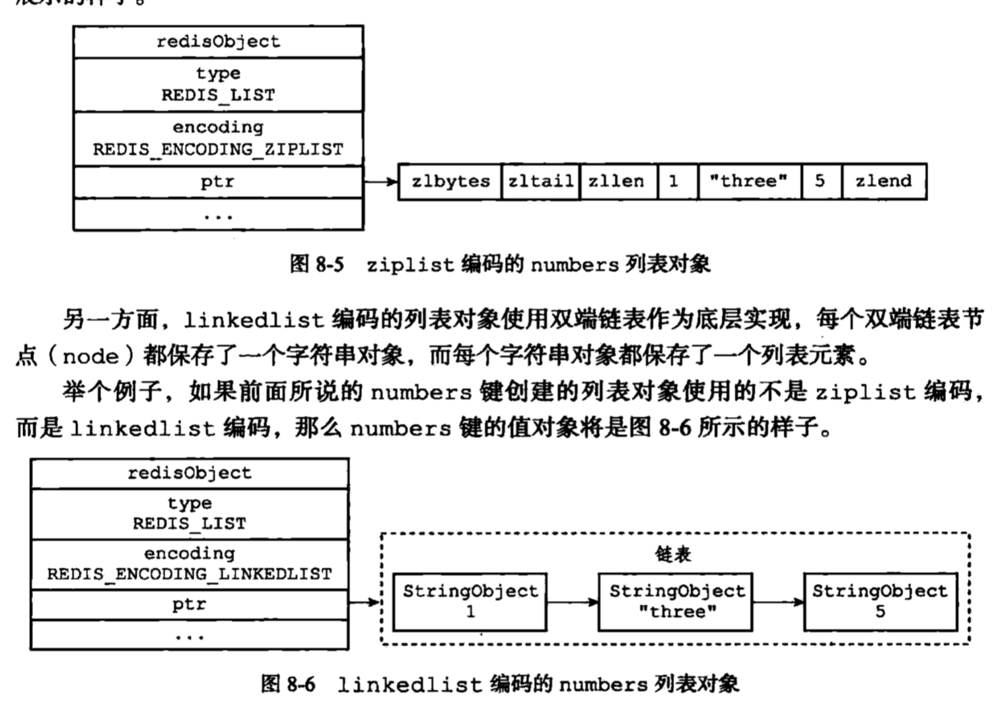

## Redis

### 面试

redis 工作模型、redis 持久化、redis 过期淘汰机制、redis 分布式集群的常见形式、分布式锁、缓存击穿、缓存雪崩、缓存一致性问题

推荐书籍：《*Redis* 设计与实现》

推荐文章：

<https://github.com/farmerjohngit/myblog/issues/1>

<https://github.com/farmerjohngit/myblog/issues/2>

<https://github.com/farmerjohngit/myblog/issues/5>

#### 常见问题

- redis 性能为什么高?
- 单线程的 redis 如何利用多核 cpu 机器？
- redis 的缓存淘汰策略？
- redis 如何持久化数据？
- redis 有哪几种数据结构？
- redis 集群有哪几种形式？
- 有海量 key 和 value 都比较小的数据，在 redis 中如何存储才更省内存？
- 如何保证 redis 和 DB 中的数据一致性？
- 如何解决缓存穿透和缓存雪崩？
- 如何用 redis 实现分布式锁？

### 对象

1. 对象 = (type, encoding, point) 组成

2. type只有5种: STRING LIST HASH SET ZSET

3. 底层编码方式若干种, 但是对于同一个类型, 可以用不用的编码方式, 比如LIST, 可以用ZIPLIST

   也可以用LINKEDLIST. 对于STRING, 可以有int, embstr.

4. redis会评估数据量大小, 然后选择合适的底层实现, 并且在数据量发生变化之后, 会自己更改为更合适的数据结构.

#### string

1. `long double`是用embstr方式来储存的. 其浮点数特性是通过取出来计算实现的.
2. 

#### list 

1. 使用`ziplist` 的条件:

   - 个数小于512个
   - 保存的`字符串`元素长度小于64字节

   以上两个条件是可以改配置文件修改的.

2. redis 3.2.4 出了quicklist, 其实就是linkedlist里面套上ziplist. 更加节省内存. 但是默认是不开的

3. 之后不再用ziplist来实现list

#### hash

1. ziplist hashtable
2. 使用ziplist, 同样可以配置. 而且没有没取消掉

#### set

1. intset  hashtable
2.  
   1. 集合对象保存的所有元素都是整数值；
   2. 集合对象保存的元素数量不超过 `512` 个；
3. 

